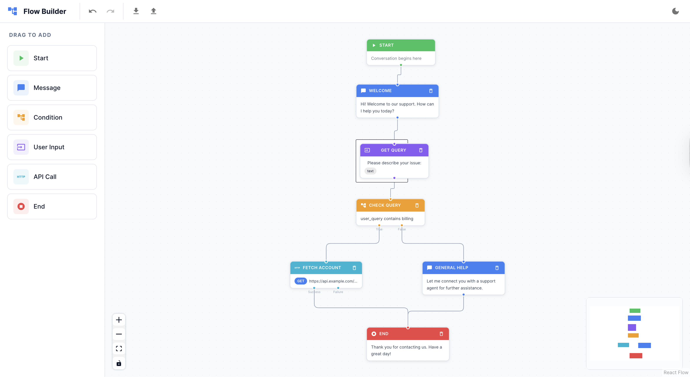
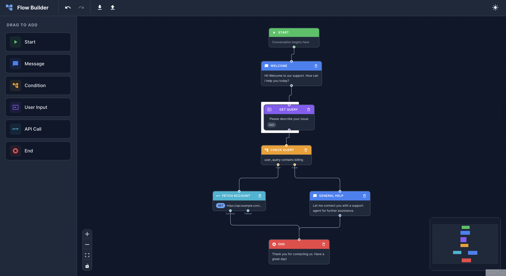

# Visual Flow Builder

A drag-and-drop visual editor for designing conversational and logic flows, built with React, TypeScript, and [@xyflow/react](https://reactflow.dev/).

**Live demo:** [visual-flow-builder-mu.vercel.app](https://visual-flow-builder-mu.vercel.app)

## Screenshots

| Light | Dark |
| ----- | ---- |
|  |  |

## Features

- **Five node types** — Message, Condition, Input, API Call, and End
- **Run mode** — press **Run** to execute the flow in a chat preview beside the canvas: the interpreter starts at the "Start here" node, walks edges, evaluates Condition nodes, pauses on Input nodes for your reply, and fires real HTTP requests for API Call nodes. The active node pulses on the canvas and walked edges light up as execution moves
- **Variables and templating** — Input replies and API responses are stored as variables; `{{variable}}` and `{{response.nested.field}}` placeholders are interpolated in messages, prompts, URLs, headers, and bodies
- **Start here chip** — any node can be marked as the flow's entry point from its config panel; exactly one node carries the chip and it cannot be deleted
- **Drag-and-drop** node creation from a side palette onto the canvas
- **Configurable nodes** — each node type exposes its own configuration panel
- **Connection validation** — rules enforce valid edges (e.g., branch limits per node type, no self-connections, no duplicates)
- **Animated edges** between connected nodes
- **Undo / redo** with keyboard shortcuts (`Ctrl/Cmd+Z`, `Ctrl/Cmd+Shift+Z`), backed by [zundo](https://github.com/charkour/zundo)
- **Export / import** flows as JSON
- **Light / dark theme** toggle, persisted to `localStorage`
- **Sample flow** loaded on first launch

## Tech Stack

- [React 19](https://react.dev/) + [TypeScript](https://www.typescriptlang.org/)
- [Vite](https://vitejs.dev/) for dev server and build
- [@xyflow/react](https://reactflow.dev/) for the flow canvas
- [Zustand](https://github.com/pmndrs/zustand) for state, [zundo](https://github.com/charkour/zundo) for temporal history
- [MUI](https://mui.com/) for UI components and theming
- [nanoid](https://github.com/ai/nanoid) for node IDs

## Getting Started

```bash
npm install
npm run dev
```

Then open the URL printed by Vite (typically http://localhost:5173).

### Scripts

- `npm run dev` — start the dev server with HMR
- `npm run build` — type-check and build for production
- `npm run preview` — preview the production build
- `npm run lint` — run ESLint
- `npm run test` — run the interpreter unit tests with Vitest

## Deployment

The production build is hosted on Vercel at **https://visual-flow-builder-mu.vercel.app**.

The app is a static Vite build and deploys to [Vercel](https://vercel.com) with zero server config. [vercel.json](vercel.json) pins the framework preset, rewrites all non-asset routes to `index.html` (SPA fallback), and sets immutable caching on hashed `/assets/*` files.

**Option A — Git integration (recommended):**

1. Push this repo to GitHub.
2. In Vercel, click **Add New → Project** and import the repo.
3. Vercel auto-detects Vite; leave Build Command (`npm run build`) and Output Directory (`dist`) as-is. Click **Deploy**.
4. Every push to `main` becomes a production deploy; every PR gets a preview URL.

**Option B — Vercel CLI:**

```bash
npm i -g vercel
vercel login
vercel          # first run links the project and creates a preview deploy
vercel --prod   # production deploy
```

## Project Structure

```
src/
  components/
    ConfigPanel/      Per-node configuration forms
    CustomEdges/      Animated edge component
    CustomNodes/      Node components (Message, Condition, Input, ApiCall, End)
    FlowCanvas/       Main @xyflow/react canvas
    NodePalette/      Draggable node source list
    RunPanel/         Chat preview shown in Run mode
    Toolbar/          App toolbar (undo/redo, import/export, run, theme)
  constants/          Node default data
  engine/             Flow interpreter (pure, UI-free) and variable interpolation
  hooks/              useUndoRedo, useExportImport
  store/              Zustand + zundo flow store, run store
  types/              Node data types
  utils/              Connection rules, ID generation, sample flow
```

## Node Types

| Node        | Purpose                              | Max outgoing |
| ----------- | ------------------------------------ | ------------ |
| Message     | Display a message to the user        | 1            |
| Condition   | Branch based on a variable check     | 2            |
| Input       | Collect user input into a variable   | 1            |
| API Call    | Perform an HTTP request              | 2            |
| End         | Terminates the flow                  | 0            |

The flow's entry point is not a separate node: one node carries a **Start here** chip, set via the toggle at the top of its config panel. The first node added to an empty canvas becomes the start automatically.

Connection rules are defined in [src/utils/connectionRules.ts](src/utils/connectionRules.ts).

## Run Mode

Click **Run** in the toolbar to open the chat preview. The interpreter in [src/engine/interpreter.ts](src/engine/interpreter.ts) executes a snapshot of the canvas:

| Node      | Behaviour during a run                                                                                                  |
| --------- | ----------------------------------------------------------------------------------------------------------------------- |
| Message   | Sends the (interpolated) text as a bot bubble, then follows its single edge                                              |
| Input     | Sends the prompt and pauses. Your reply is validated by input type (text / number / email / phone) and stored in the variable |
| Condition | Resolves the variable (dot paths allowed), applies the operator, and follows the `True` or `False` edge                 |
| API Call  | Performs a real `fetch` with interpolated URL / headers / body, stores the JSON (or text) response, and follows `Success` or `Failure` |
| End       | Sends the end message and finishes the run                                                                              |

Condition checks are case-insensitive for `equals` / `contains` and numeric for `greaterThan` / `lessThan`. A node with no outgoing edge on the chosen branch ends the run with a note; runaway loops stop after 200 steps. Edits made on the canvas while a run is open show a "flow changed" banner with a restart shortcut. Click any bubble in the preview to select the node that produced it.

Browsers only allow API Call nodes to reach servers that send CORS headers; a blocked request takes the `Failure` branch with an explanation.

## Architecture

See [ARCHITECTURE.md](ARCHITECTURE.md) for a walkthrough of the module layout, store design, and the main interaction flows (drag-drop, connect, edit, undo/redo, export/import).
